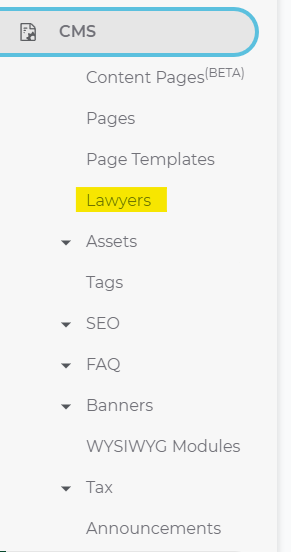
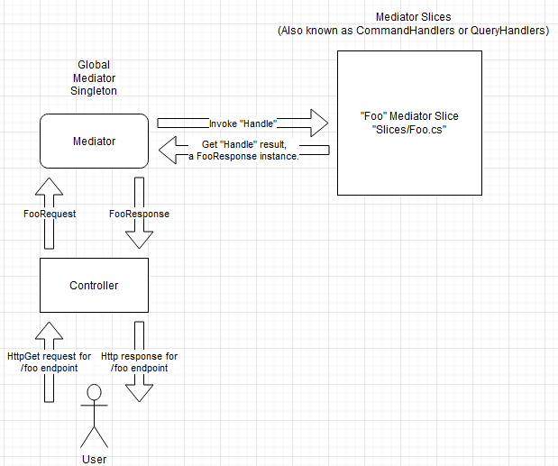
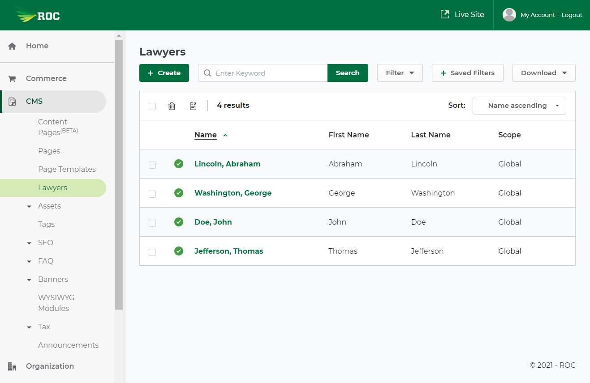
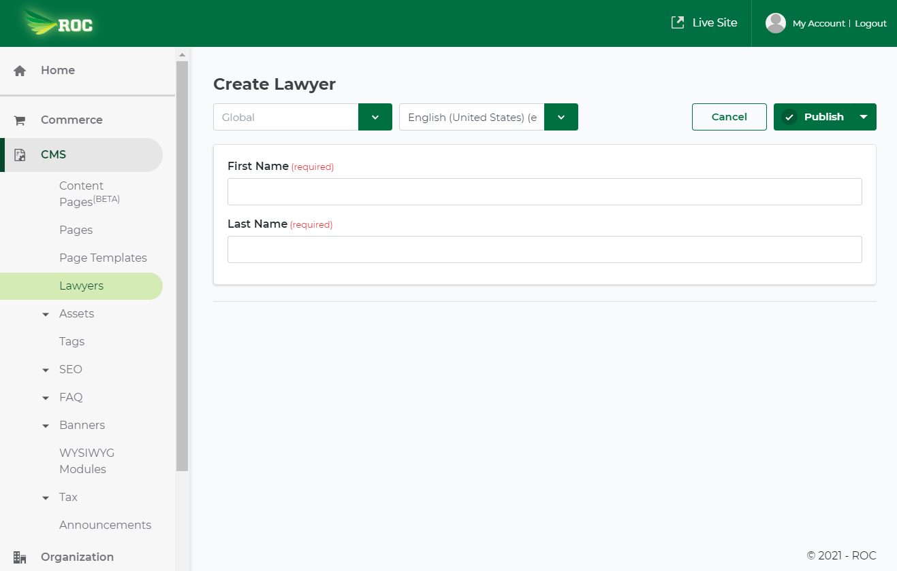

# Module 2 - Roc Basics: Scaffold a new Feature

## Learning Goals
- ROC Code Generator
- Entity Framework Migrations
- Mediator and Slices
- Creation and Basic Customization of a Feature via Code

## Getting Started - ROC Code Generator
- Install the ROC Code Generator: `dotnet new -i NewRocFeature --nuget-source http://roc-nuget.idevdesign.net/nuget`
- Create a new feature: `dotnet new rocfeature -s Lawyer -p Lawyers -cf lawyers -f Lawyers -m Lawyer`
- Advantages of code generator
  - Saves time
  - Prevents mistakes
  - Ensures consistency
- Usage:
```
Usage: dotnet new rocfeature [options]

Options:
  -m|--model                    The Title Case model name for the new feature.
                                string - Required

  -s|--singular                 Singular Title Case display name used in places like the model [DisplayNameEx()] attribute and the Definition.ts file.
                                string - Required

  -p|--plural                   Plural Title Case display name used in places like the model [DisplayNameEx()] attribute and the Definition.ts file.
                                string - Required

  -f|--featureFolder            Backend feature folder name.
                                string - Required

  -cf|--clientAppFeatureFolder  Client app feature folder name.
                                string - Required

  -v|--versionable              Enables versioning on the model.
                                bool - Optional
                                Default: false / (*) true

  -ar|--ajaxRoute               The base url for the ajax endpoints. If not specified, the feature folder path will be used.
                                string - Optional

  -cr|--clientRoute             The base route for the client app. If not specified, the feature folder path will be used.
                                string - Optional


* Indicates the value used if the switch is provided without a value.
```

## ROC Hierarchy
- Core Files: `Roc\Features\Lawyers`
    - **Models**:
        - Models are essentially tables in the database
        - Location: `Roc\Features\Lawyers\Models`
    - **DbSet**: 
        - Used to access the database with Entity Framework
        - Location: `Roc\Features\Lawyers\Model\Lawyer.DbSets.cs`
    - **Services**:
        - Classes which contain helper methods that can be used
        - Location: `Roc\Features\Lawyers\Services`
    - **Slices**
        - Similar to controller actions
        - Location `Roc\Features\Lawyers\Slices`
    - **Dtos**:
        - Data transfer objects (DTO) that are used for mediator requests and responses
        - Location: Inside slice classes
- Admin Files:
    - Backend Controllers: `Roc.Admin\Features\Lawyers`
    - React Components: `Roc.Admin\ClientApp\features\lawyers`
    - EntityDefinition
- Storefront Files:
    - Controllers and Views: `Roc.Web\Features\Lawyers\`
    - React Components: `Roc.Web\ClientApp\features\lawyers`

## Entity Framework Migrations Overview
- When using EF, all db schema changes should be applied via migrations
- Migrations run in order
- `Up` portion of a migration is ran when applying the migration
- `Down` portion of a migration is ran when reverting a migration
- Create a new migration command: `dotnet ef migrations add <MigrationName>`
- Run all migrations: `dotnet ef database update`
- Jump to a specific migration `dotnet ef database update <MigrationName>`
- Remove the last migration: `dotnet ef migrations remove` (migration removed cannot be currently applied to the db)
- Used for the following database operations
    - CREATE, ALTER, or DROP TABLE
    - CREATE, ALTER, or UPDATE INDEX
    - Custom migration can be used to UPDATE rows in a table

## Add Lawyer Table to the Database
- Navigate to the migrations project: `cd Roc.Migrations.Commerce`
- Create a migration: `dotnet ef migrations add AddLawyers`
- Run the migration: `dotnet ef database update`

## Add Admin Lawyer Routing and Navigation
- Add lawyer navigation: `ClientApp/components/shared/layout/sidebar/SideBarItemProvider.tsx`
```
// Admin navigation object
const siteSidebarItems: SidebarItemList = [
	createParentSidebarItem({
		label: 'CMS',
		children: [
			createSubSidebarItem({ label: 'Content Pages', link: '/cms/content-page', isBeta: true }),
			createSubSidebarItem({ label: 'Pages', link: '/cms/pages' }),
     	    createSubSidebarItem({ label: 'Page Templates', link: '/cms/templates' }),
			createSubSidebarItem({ label: 'Lawyers', link: '/cms/lawyers' }),
```



- Add lawyer routes: `Roc.Admin/ClientApp/routes.Roc.tsx`
```
import Lawyers from 'features/lawyers/Routes';

export default (
    <>
        // existing routes
        {Lawyers}
    </>
);
```


## Mediator Basics
- A “mediator slice” is essentially a way to decouple the logic of a controller action from the actual controller



- By abstracting controller logic into mediator slices, we get the following benefits:
    - **Overridability**
        - Projects may need to change the logic of a particular controller action. Doing this inline will likely
        cause merge conflicts when upgrading ROC versions.
        - However, a project could create their own mediator slice which inherits from ROC's mediator slice. Then
        a project can override the base slice's methods to meet their own needs. This pattern will help ensure that
        upgrading ROC versions goes smoothly.
    - **Testability**
        - By decoupling controller logic from the controller, we can easily test the critical parts of a controller's
        actions.
        - A typical pattern that can be utilized inside a C# integration test involves calling a mediator slice's `Handle` method and then
        verifying the database matches up with the expected results from a mediator request or response.
        - Furthermore, when projects build ontop of base slice methods, they should not need to update integration tests that
        involve base slice methods.
- `Handle` method is the main method that gets called by a slice
- ROC Admin Slices
    - **Edit**: Creates or updates an entity via data entered into an Admin edit form
    - **Listing**: Gets a paginated list of entities for an Admin listing page
    - **Query**: Sets the base queryable for listings and autosuggest results. Allows adding filters to listings
    - **Delete**: Soft deletes a single entity
    - **BulkDelete**: Soft deletes a group of entities via a background job. Roc.Tasks needs to be running for this to occur
    - **Suggest**: Gets a paginated list of entities based on text entered into an Admin autosuggest field
    - **Import**: Creates or updates an entity via data uploaded in a csv or excel file
    - **Export**: Generates a csv or excel file containing a list of entities which can be downloaded by an Admin
    - **Definition**: Not an actual slice but located at the same level. Contains a list of endpoints for an entity
- Query vs Command Slices
    - Query
        - Gets data from the database
        - Similar to a `SELECT` in SQL
    - Command
        - Creates or edits an existing entity
        - Similar to an `INSERT` or `UPDATE` in SQL
- Admin Edit Slices
    - Used for edit pages
    - Typically contains both a `Query` and `Command` handler class
        - `Query` populates the form with an entity's existing data
        - `Command` creates or updates an entity
    - Base class `Handle` methods:
        - `EditQueryHandlerBase.Handle`: This maps models from the database into response dtos. Calls these methods in this order:
            - `UpdateQueryable`: Update the queryable to load navigational properties into the results
            - `LoadDataFromHistoriesAsync`: When targeting a previous history entry, load those values into the loaded entity
            - `LoadTranslationsAsync`: Loads the translations from the database for this record
            - `BeforeMapAsync`: This method executes prior to mapping the entity to the result DTO
            - `Mapper.Map`: Converts the model queried from the database into a response DTO. This can be customized by creating a `MappingProfile`
            - `AfterMapAsync`: This method executes after mapping the entity to the result DTO
            - `LoadHistoriesAsync`: Load the historical data into the entity
            - `LogEventAsync`: Logs a view event to the event log
        - `EditCommandHandlerBase.Handle`: This maps requests dto sent from the client into models which are saved to the database. Calls these methods in this order
            - `CreateOrLoadEntityAsync`: Either loads the existing entity from the backend, or creates a new entity
            - `EnforceConcurrency`: Ensures concurrency by checking if the entity was modified after the form was loaded
            - `GetOriginalParentId`: If this is a hierarchy type, get the original parent Id of this node so we can detect changes in the tree positioning.
            - `MapEntityAsync`: Maps a request into a model. Calls in these methods in the following order
                - `BeforeMappingAsync`: This method executes *before* mapping the posted command to the entity
                - `Mapper.Map`: Converts request DTOs into models to be saved to the database. This can be customized by creating a `MappingProfile`
                - `AfterMappingAsync`: This method executes *after* mapping the posted command to the entity
            - `UpdateEntityAsync`: Update various fields on the entity including:
                - Status
                - CreateUser and ModifyUser Ids
                - ParentId
                - Scope
                - Primary Culture
                - Translations
                - Canonical Reference
                - 301 Redirects
            - `UpdateHierarchyEntityAsync`: If this is a hierarchy type, update the hierarchy positioning/sorting on it and its children.
            - `PersistChangesAsync`: Persists the changes to the database
            - `LogEventAsync`: Logs an add or edit event to the event log
            - `AfterSaveChangesAsync`:  Override this method to write code after database changes are saved
- Admin Listing Slices
    - Used for listing pages
    - Should only contain a `Query` handler class
    - `QueryHandlerBase.Handle` simplified pipeline:
        - `GetQueryableAsync`:  Prepare the queryable for execution by:
            - Applying filters (several methods involved here)
            - `IncludeQueryableAsync`: Joining related data
            - `SortQueryableAsync`: Sorting the results
            - Ignoring global query filters: `queryable = queryable.IgnoreQueryFilters().AsNoTracking()`
        - Paginates the listings by calling `queryable.ToPaginatedListAsync`. This can be customized by altering the request dto
        - `AfterQueryResultsAsync`: Runs after the results have been queried
        - `AfterMappingAsync`: Converts the models queried from the database into response DTOs
        - `UpdateResultAsync`: Update the query results with paging data and set the basic search fields
- Examples of ROC Web Slices
    - Command type example: Add to Order - `Roc\Features\Commerce\Orders\Slices\FrontEnd\AddToOrder.cs`
    - Query type example: Get Product Details - `Roc\Features\Commerce\Products\Slices\FrontEnd\GetProductDetails.cs`

## Modify the Lawyer to Have a First and Last name
- Update Lawyer Model to have `FirstName` and `LastName` instead of just name
- Fix References to `Name` to be `FirstName`
    - Remove inheritance of `INamedModel` on the `Lawyer` class *(It is important you do this before the next step)*
    - Use VS2019 to rename `Name` to `FirstName`
- Add a `LastName` property to the `Lawyer` model class
- Create a migration: `dotnet ef migrations add UpdateLawyerNames`
- Run the migration: `dotnet ef database update`
- Attempt to create a lawyer. Notice it is failing
- Update `Roc.Features.Lawyers.Edit.Dto.Name` to be `FirstName`
- Add a `LastName` property to `Roc.Features.Lawyers.Edit.Dto`.
- Update the edit form in react
    - File: `Roc.Admin\ClientApp\features\lawyers\LawyerEdit.tsx`
    - Change `TranslatedField` component for "Name" to have a label of "First Name" and a name of "firstName"
    - Add another `TranslatedField` component with a label of "Last Name" and a name of "lastName"
- Update the mapping profile of the `Roc.Features.Lawyers.Listing.Dto`
```
public partial class MappingProfile : Profile
{
    public MappingProfile()
    {
        this.MapDto<Lawyer, Dto>()
            .ForMember(dto => dto.Name, opt => opt.MapFrom((entity, dto) => dto.Name = $"{entity.LastName}, {entity.FirstName} "));
    }
}
```
- Update the listing page to have columns for first and last names by adding `FirstName` and `LastName` to `Roc.Features.Lawyers.Listing.Dto`

## Add Lawyer Database Constraints and Server-Side Validation
- Add a database constraint for the `LastName` column within `Roc\Features\Lawyers\Model\LawyerModelCreating.cs`
- Add Server Side validation for the `FirstName` and `LastName` fields inside the Lawyer `Edit` Slice
```
public partial class CommandValidator : EditCommandValidatorBase<Dto, Lawyer>
{
    public CommandValidator(IServiceProvider serviceProvider) : base(serviceProvider)
    {
        RuleFor(dto => dto.FirstName).NotEmpty();
        RuleFor(dto => dto.LastName).NotEmpty();
    }
}
```

## Final Result of Edit and Listing Pages
### Listing Page


### Edit Page


## Conclusion of Module 2
